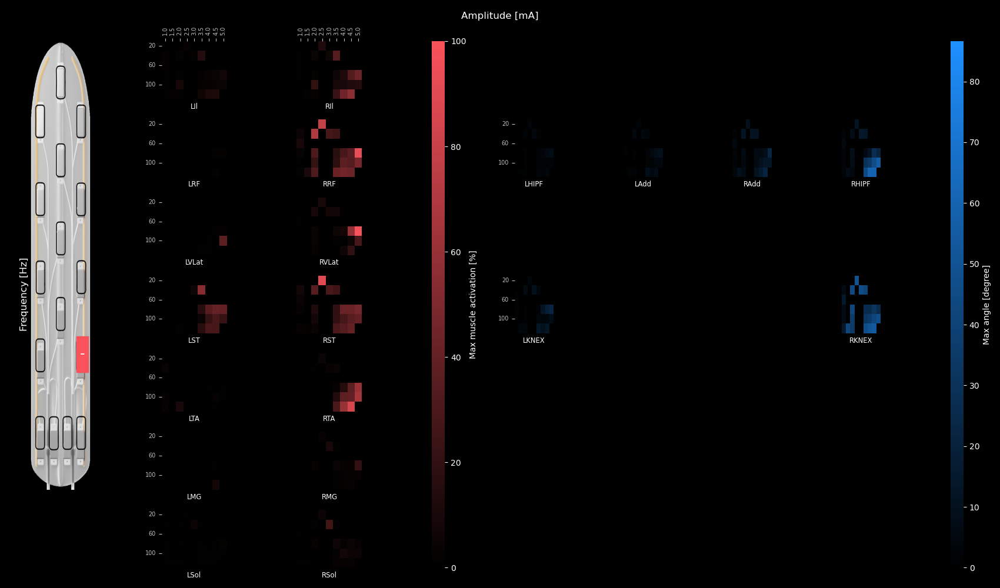

# Spinal cord stimulation induced leg dynamics in SCI patients : restore walking through AI !

This project, which started as an internship and later became my master thesis, focuses on helping spinal cord injury patients regain their ability to walk. These patients are implanted with a neurostimulator that uses epidural electrical stimulation (EES) to activate the muscles in their lower limbs. However, fine-tuning the electrical parameters to reproduce natural walking motion is a complex challenge.

To tackle this, we developed AI models (like LSTMs and RNNs, see model.py) to predict muscle activity based on stimulation parameters. We then coupled these predictions with biomechanical modeling (biomechanical.py) to simulate the resulting walking motion. The result is a framework that bridges neuroscience, biomechanics, and AI to bring us closer to restoring mobility for those who need it most.

## Environment creation ##

<ol>

<li>create conda environment with name little_RNN</li>
conda create -n little_RNN anaconda python=3.9

<li>activate environment 
conda activate little_RNN

<li>install sklearn genetics</li>
conda install -c conda-forge sklearn-genetic

<li>install pytorch</li> 
follow instruction on pytorch webpage get started : https://pytorch.org/get-started/locally/ 

<li>update the environment 
conda update --all 

</ol>

## Data ## 

<li> Next to the srcnew folder create a folder named "tests_results". Put your data folder in "tests_results".</li>

Your data should be a dataframe in which rows are trials and colums parameters. For each muscle, an associated column should contain the arrays of EMG recordings. 
The data should be pre-filtered and normalized per muscle. 

## Training an RNN ## 

To train an RNN : 

<ol>

<li> Check the constant parameters in the __init__.py file of each package</li>

<li> In the folder src/tests/params_files create a new_parameters file that has the name "constants_{name_of_your_test}" following the demo parameters file.</li>

<li> To lauch the training type in the source folder "python main_rnn_training.py "{name_of_your_test}".</li>

The code will store the results of your test in the folder "tests_results".
<li> To lauch the training of the stim-to-kin rnn, enter "python main_rnn_EMGtoKin.py".</li>

</ol>

## Scripts descriptions ##
<li>  Visualize files generate gif displaying stim , emg and kin in sync.</li>
<li>  SeeDatajoints.py generates pictures showing all signals available for every trial.</li>
<li>  Quantify.py generates heatmaps for various data quantifications.</li>
<li>  makeDataset.py generates files containing data for one or several selected trial.</li>
<li>  newMG_biomechanicalAlice2.py is the file to run the biomechanical model.</li>
<li>  joint_to_coo.py has tools to extract hip, knee and ankle coordinates from kinematic data.</li>
